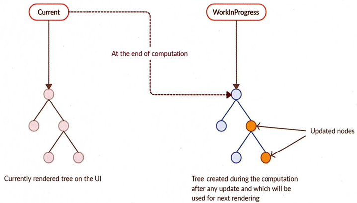
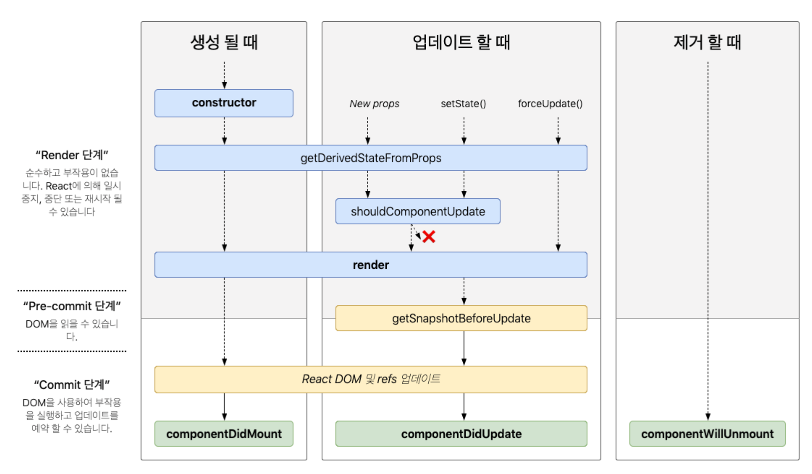

# 리액트 핵심 요소 깊게 살펴보기

## JSX란?
* 보통 리액트를 통해 JSX를 접하기 때문에 JSX가 리액트의 전유물이라고 오해하는 경우가 있다. → 반은 맞고 반은 틀림

* JSX는 흔히 개발자들이 알고 있는 XML과 구조적으로 유사한 내장형 구문이며(구조적으로 비슷해보이지만 각각의 용도와 사용 환경은 다름), 리액트에 종속적이지 않은 독자적인 문법으로 보는 것이 옳다.

* 페이스북에서 독자적으로 개발했기에 자바스크립트 표준의 일부는 아니다. 따라서 JSX가 포함된 코드는 반드시 트랜스파일러를 거쳐야 비로소 자바스크립트 런타임이 이해할 수 있는 의미 있는 자바스크립트 코드로 변환된다. 

* JSX의 설계 목적
    * 다양한 트랜스파일러에서 다양한 속성을 가진 트리 구조를 토큰화해 ECMAScript로 변환하는데 초점을 두고 있다.
    * 쉽게 이야기 하면, **JSX 내부에 트리 구조로 표현하고 싶은 다양한 것들을 작성해두고, 이 JSX를 트랜스파일이라는 과정을 거쳐 자바스크립트가 이해할 수 있는 코드로 변경하는 것이 목표라 볼 수 있다.**

### JSX의 정의
* JSX의 4가지 기본 컴포넌트 구성
    * `JSXElement`
        * JSX를 구성하는 가장 기본적인 요소, HTML의 요소(element)와 비슷한 역할을 함.
        * 형태
            * `JSXOpeningElement`, `JSXClosingElement`
                * 두 요소는 일반적인 HTML 태그와 같은 형태로 사용된다. 따라서 반드시 쌍으로 사용되어야 한다.
                * 사용 상황:
                    * 여러 자식을 포함하는 경우 : 태그 내부에 다른 태그나 텍스트를 포함하여 구조를 잡을 때 사용
                    * 상태나 props에 따라 내용이 동적으로 변할 때: 렌더될 내용을 조건에 따라 다르게 보여주고 싶을떄 사용
                ```javascript
                const MyComponent = (props) => {
                    return (
                    <div>
                    <h1>안녕하세요, {props.name}</h1>
                    <p>React JSX 예시입니다.</p>
                    </div>
                    );
                };

                export default function App() {
                    return ( 
                    <MyComponent name={"sooyeon"}>
                    </MyComponent>
                    );
                }
                ```
                * 위 예제에서 보이는 \<MyComponent>와 \</MyComponent>가 JSXOpeningElement와 JSXClosingElement로 이루어져 있다.
            * `JSXSelfClosingElement`
                * 요소가 시작되고, 스스로 종료되는 형태를 의미한다. 자식 요소가 없는 경우 사용된다.
                * 이는 HTML의 단일 태그(\, \<input /> 등)와 유사하다.
            * `JSXFragment`
                * 아무런 요소가 없으며 반환되는 요소가 여러개인 경우 여러 요소를 그룹화할 때 사용된다. 
                * ReactFragment는 <React.Fragment></React.Fragment> 또는 간단한 단축 문법인 <></>를 사용하여 작성할 수 있다.
        * 이러한 요소들을 활용하여 더 유지보수 가능하고 읽기 쉬운 코드를 작성하는데 도움을 준다.

        * 리액트에서 컴포넌트를 만들어 사용할 때는 반드시 대문자로 시작하는 컴포넌트를 만들어야 사용 가능하다. 이유는 HTML 태그명과 사용자가 만든 컴포넌트 태그명을 구분 짓기 위해서다.
        
        * `JSXElementName` : 요소 이름을 짓는 원칙이 있다. 그 원칙을 함께 살펴보자.
            * `JSXIdentifier` : JSX 내부에서 사용할 수 있는 식별자를 의미한다. 그리고 자바스크립트와 마찬가지로 숫자로 시작하거나 $와 _외의 다른 특수문자로는 시작할 수 없다.
                ```javascript
                <Component />
                ```
                * 장점 : 읽기 쉽고 간단하며, 대부분의 일반적인 컴포넌트 사용 사례에 적합하다.
            
            * `JSXNamespacedName`: `JSXIdentifier:JSXIdentifier`의 조합
                * 즉 :을 통해 서로 다른 식별자를 이어주는 것도 하나의 식별자로 취급된다. :로 묶을 수 있는 것은 한 개뿐이다.
                * JSX 구문에서 네임스페이스 접두사가 있는 이름을 나타내기 위한 용어이다.
                    ```Javascript
                    <namespace:Component />
                    ```
                * JSX에서는 대부분의 네임스페이스 관련 작업이 자동으로 처리되어 개발자가 명시적으로 `JSXNamespaceName`을 명시하는 경우는 드물다.

            * `JSXMemberExperssion`: `JSXIdentifier.JSXIdentifier`의 조합
                * 즉 .을 통해 서로 다른 식별자를 이어주는 것도 하나의 식별자로 취급된다. .는 여러 개 이어서 하는 것도 가능하다. 단, JSXNamespacedName과 이어서 사용하는 것은 불가능하다.
                    ```javascript
                    const MyComponents = {
                        DatePicker: function DataPicker(props) {
                            return <div>{props.date}</div>
                        }
                    };

                    function App() {
                        return(
                            <div>
                                <MyComponents.DatePicker date={new Date().toLocaleDateString()}>
                            </div>
                        )
                    }
                    ```
                * 위 코드에서 <MyComponents.DatePicker />는 JSXMemberExpression의 예시이다. 이 표현식은 MyComponents 객체의 DatePicker 속성을 참조한다.
                * React에서 JSXMemberExpression은 내부적으로 중요한 역할을 하지만, 개발자가 이를 다루거나 언급할 필요 없다. **React와 Babel등의 도구는 이러한 내부적인 복합성을 자동으로 처리하여 개발자가 더 생산적으로 작업할 수 있도록 돕는다.**

    * JSXAttributes
        * JSXElement에 부여할 수 있는 속성을 의미한다. 단순히 속성을 의미하기 때문에 모든 경우에서 필수값이 아니고, 존재하지 않아도 에러가 나지 않는다.

            * JSXSpreadAttributes: 자바스크립트의 전개 연산자(스프레드 연산자)와 동일한 역할을 한다고 볼 수 있다. 따라서, 스프레드 연산자를 사용해 여러 속성을 한번에 추가할 때 사용한다. 
                * {...AssignmentExpression}: 이 AssignmentExpression에는 단순히 객체뿐만 아니라 자바스크립트에서 AssignmentExpression으로 취급되는 모든 표현식이 존재할 수 있다. 여기에 조건문 표현식, 화살표 함수, 할당식 등 다양한 것이 포함되어 있다.
                * 아래의 예시로 이해를 돕는다.
                ```javascript
                import React from 'react';

                const Button = (props) => {
                    return <button {...props}>{props.label}</button>;
                }

                const App = () => {
                    const buttonProps = {
                        type: 'button',
                        onClick: () => alert('Button Clicked'),
                        style: {backgroundColor: 'blue', color: 'white'},
                        label: 'Click me',
                    }

                    return {
                        <div>
                            <h1>JSXSpreadAttributes Example</h1>
                            <Button {...buttonProps}>
                        </div>
                    }
                }

                export default App;
                ```
                이렇게 하면 각 속성을 하나씩 전달하는 대신 간편하게 한번에 전달할 수 있어서 코드가 더 깔끔해지고 유지보수하기 쉬워진다. 

            * JSXAttributeValue: 속성의 키에 할당할 수 있는 값으로, 다음 중 하나를 만족해야 한다.
                * `"큰따옴표로 구성된 문자열"`: 자바스크립트의 문자열과 동일하다. 안에 아무런 내용이 없어도 상관없다.
                * `'작은따옴표로 구성된 문자열'`: 자바스크립트의 문자열과 동일하다. 안에 아무런 내용이 없어도 상관없다.
                * `{ AssignmentExpression }`: 자바스크립트의 AssignmentExpression을 의미한다. AssignmentExpression은 자바스크립트에서 값을 할당할 때 쓰는 표현식을 말한다. 즉, 자바스크립트에서 변수에 값을 넣을 수 있는 표현식은 JSX 속성의 값으로도 가능하다.
                * `JSXElement`: 값으로 다른 JSX 요소가 들어갈 수 있다. 리액트에선 자주 보이진 않는 코드이다.
                * \<Child attribute=\{\<div>hello\</div>\} />와 같이 값으로 들어가는 리액트 컴포넌트를 {}로 감싸는 걸 보는 것이 더 익숙할텐데, 사실 이것은 문법적 오류가 아닌 prettier의 규칙(태그가 포함된 JSX 구문을 좀 더 읽기 쉽게 만들기 위해 제공)이다.
                * `JSXFragment`: 값으로 별도 속성을 갖지 않는 형태의 JSX 요소가 들어갈 수 있다. 즉, 비어 있는 형태의 <></>가 허용된다.
    * JSXChildren
        * JSXElement의 자식 값을 나타낸다. JSX는 속성을 가진 트리 구조를 나타내기 위해 만들어졌기 때문에 JSX로 부모와 자식 관계를 나타낼 수 있으며, 그 자식을 JSXCildren이라고 한다.
        
        * `JSXChild`: JSXChildren을 이루는 기본 단위다. JSXChildren은 JSXChild를 0개 이상 가질 수 있다.
            * `JSXText`: {,<,>,}을 제외한 문자열.
            * `JSXFragment`: 값으로 빈 JSX요소인 <></>가 들어갈 수 있다.
            * `{ JSXChildExpression (optional) }`: 이 JSXChildExpression은 자바스크립트의 **AssignmentExpression(화살표 함수)**을 의미한다.
                ```javascript
                // 이 함수를 리액트에서 렌더링하면 'foo'라는 문자열이 출력됨.
                export default function App() {
                    return <>{(() => 'foo')()}</>
                }
                ```

    * JSXStrings
        * JSXAttributeValue와 JSText는 HTML과 JSX사이에 복사와 붙여넣기를 쉽게 할 수 있도록 설계되어 있다. HTML에서 사용 가능한 문자열은 모두 JSXString에서도 가능하다. → 개발자가 HTML 내용을 손쉽게 JSX로 가져올 수 있도록 의도적으로 설계된 부분임
            * 여기서 정의된 문자열은 "큰따옴표로 구성된 문자열", '작은 따옴표로 구성된 문자열' 혹은 JSXText를 의미함.
            * 자바스크립트와 한 가지 중요한 차이점
                * \로 시작하는 이스케이프 문자 형태소다. \는 자바스크립트에서 특수문자를 처리할 때 사용되므로 몇 가지 제약 사항(\를 표현하기 위해서 \\\로 이스케이프해야 함)이 있지만 HTML에서는 아무런 제약 없이 사용할 수 있다.

### JSX 예제
```javascript
// 하나의 요소로 구성된 가장 단순한 형태
const ComponentA = <A>안녕하세요</A>

// 자식이 없이 SelfClosingTag로 닫혀 있는 형태도 가능하다.
const ComponentB = <A />

// 옵션을 {}와 전개 연산자로 넣을 수 있다.
const ComponentC = <A {...{ required: true}} />

// 속성만 넣어도 가능하다.
const ComponentD = <A required />

// 속성과 속성을 넣을 수 있다.
const ComponentE = <A required={false} />

const ComponentF = (
    <A>
        {/* 문자열은 큰따옴표 및 작은따옴표 모두 가능하다. */}
        <B text="리액트" />
    </A>
)

const ComponentG = (
    <A>
        {/* 옵션의 값으로 JSXElement를 넣는 것 또한 올바른 문법이다.*/}
        <B optionalChildren={<>안녕하세요.</>} />
    </A>
)

const ComponentH = (
    <A>
        {/* 여러 개의 자식도 포함할 수 있다. */}
        안녕하세요
        <a text="리액트" />
    </A>
)
```
### JSX는 어떻게 자바스크립트에서 변환될까?
JSX가 자바스크립트로 어떻게 변환되는지 알아야 하는 이유는 **중복 코드를 최소화할 수 있기에 유용하기 때문**이다. 그럼 어떻게 변환하는지 살펴보자.

* 우선 자바스크립트에서 JSX가 변환되는 방식을 알려면 리액트에서 JSX를 변환하는 Babel(@babel/plugin-transform-react-jsx 플러그인)을 알아야 한다. (JSX 구문 → 자바스크립트가 이해할 수 있는 형태로 변환)

* 예시
    * JSX 코드
        ```javascript
        const ComponentA = <A required={true}>Hello World</A>
        
        const ComponentB = <>Hello World</>

        const ComponentC = (
            <div>
                <span>hello world</span>
            </div>
        )
        ```
    * 리액트 17, 바밸 7.9.0 이전 버전에서 변환한 결과를 보면
    * JSX 코드를 Babel(@babel/plugin-transform-react-jsx)로 변환한 결과
        ```javascript
        'use strict'

        var ComponentA = React.createElement(
            A, 
            {
            required: true,
            },
            'Hello World',
        )
        var ComponentB = React.createElement(React.Fragment, null, 'Hello World')
        var CompoentC = React.createElement(
            'div',
            null,
            React.createElement('span', null, 'hello world'),
        )
        ```
        * JSXElement를 첫 번째 인수로 선언해 요소를 정의함 (태그 이름, 컴포넌트)
        * 옵셔널인 JSXAttributes, JSXChildren, JSXString는 이후 인수로 넘겨주어 처리한다.

        따라서 이 변환하는 과정을 봤을 때 **트랜스파일러인 Babel은 이러한 JSX로 작성된 코드를 React.createElement 호출로 변환하는 것**을 알 수 있다. 결국 JSX가 React.createElement와 동일한 역할을 한다고 볼 수 있다.

        이 점을 활용한다면 앞서 말했듯이 경우에 따라 다른 JSXElement를 렌더링 해야할 때 요소 전체를 감싸지 않더라도 처리할 수 있다.
        ```javascript
        // props 여부에 따라 children 요소만 달라지는 경우
        function TextOrHeading({
            isHeading,
            children,
        }: PropsWithChildren<{ isHeading: boolean }>) {
            return isHeading ? (
                <h1 className = "text">{children}</h1>
            ) : (
                <span className = "text">{children}></span>
            )
        }

        // JSX가 변환되는 특성을 활용한다면 간결하게 처리할 수 있다.
        import {createElement} from 'react'

        function TextOrHeading({
            isHeading,
            children,
        }: PropsWithChildren<{ isHeading: boolean }>) {
            return createElement(
                isHeading ? 'h1' : 'span',
                { className: 'text' },
                children,
            )
        }
        ```
        * 대부분의 경우에는 JSX를 사용하는 것이 가독성과 유지 보수 측면에서 더 좋다.
        * 특정 상황(일반적이지 않은 경우, 동적으로 요소를 생성해야 하는 특수한 경우)에서만 React.Element를 직접 사용하여 동적인 요소를 생성하는 것이 더 나은 방법일 수 있다.

### 정리
* JSX 문법에는 있지만 실제로 **리액트에서 자동으로 처리하여 사용하지 않는** `JSXNamespaceName`, `JSXMemberExpression`가 있으며, 이는 React가 아닌 Preact, SolidJS 등 다양한 라이브러리도 JSX를 채용하여 리액트와는 다르게 목적에 따라 사용할 수 있어 알고 있어야 하는 문법이다.

* JSX는 자바스크립트 코드 내부에 HTML과 같은 트리 구조를 가진 컴포넌트를 표현할 수 있다는 점에서 각광받고 있다. but, JSX가 HTML 문법과 자바스크립트 문법이 뒤섞여서 코드의 가독성을 해친다는 의견도 있다.

* 그래도 현재 많이 사용되는 것으로 파악되고 있으며 리액트 내부에서 JSX가 어떻게 변환하는지 원리를 알고 있으면 컴포넌트 구성에 더 효율적일 수 있다.

## 가상 DOM과 리액트 파이버
### DOM과 브라우저 렌더링 과정
* DOM(Documnet Object Mdoel, 문서 객체 모델)이란?
    * 텍스트 파일로 만들어져 있는 웹 문서를 브라우저에 렌더링하려면 웹 문서를 브라우저가 이해할 수 있는 구조로 메모리에 올려야 한다. 브라우저 렌더링 엔진은 웹 문서를 로드한 후, 파싱하여 웹 문서를 브라우저가 이해할 수 있는 구조로 구성하여 메모리에 적재하는 것
    * 브라우저가 HTML 웹 페이지를 인식하는 방식을 **계층화**(순서에 따라 우선순위를 부여)시켜 **트리구조**로 만든 객체(Object)모델
    * 브라우저가 웹사이트 접근 요청을 받고 화면을 그리는 과정
        1. 브라우저가 사용자가 요청한 주소를 방문해 HTML 파일을 다운로드 한다.
        2. 브라우저의 렌더링 엔진은 HTML을 파싱해 DOM 노드로 구성된 트리(DOM)를 만든다.
        3. 2번 과정에서 CSS 파일을 만나면 해당 CSS 파일도 다운로드한다.
        4. 브라우저의 렌더링 엔진은 이 CSS도 파싱해 CSS 노드로 구성된 트리(CSSOM)를 만든다.
        5. 브라우저는 2번에서 만든 DOM 노드를 순회하는데, 여기서 모든 노드를 방문하는 것이 아니고 사용자 눈에 보이는 노드만 방문한다. 즉, display: none과 같이 사용자 화면에 보이지 않는 요소는 방문해 작업하지 않는다. 
        6. 5번에서 제외된, 눈에 보이는 노드를 대상으로 해당 노드에 대한 CSSOM 정보를 찾고 여기서 발견한 CSS 스타일 정보를 이 노드에 적용한다.
            * DOM 노드에 CSS를 적용하는 방법
                * `레이아웃(layout, reflow)` : 각 노드가 브라우저 화면의 어느 좌표에 정확히 나타나야 하는지 계산하는 과정. 이 레이아웃 과정을 거치면서 반드시 페인트 과정도 거치게 된다.
                * `페인팅(painting)`: 레이아웃 단계를 거친 노드에 색과 같은 실제 유효한 모습을 그리는 과정

    * 예시코드를 살펴보자
        ```html
        #text {
            background-color: read;
            color: white;
        }
        <!DOCTYPE html>
        <html>
            <head>
                <link rel="stylesheet" type="text/css" href="./style.css" />
                <title>Hello React!</title>
            </head>
            <body>
                <div style="width: 100%;">
                    <div id="text" style="width: 50%;">Hello world!</div>
                </div>
            </body>
        </html>
        </html>
        ```

        1. HTML을 다운로드한다. 다운로드와 함께 HTML을 분석하기 시작
        2. 스타일시트가 포함된 link 태그를 발견해 style.css를 다운로드
        3. body 태그 하단의 div는 width: 100%이므로 뷰포트(브라우저가 사용자에게 노출하는 영역)로 좌우 100% 너비로 잡는다.
        4. 3번 하단의 div는 width: 50%, 즉 부모 50%를 너비로 잡아야 하므로 전체 영역의 50%를 너비로 잡는다.
        5. 2번에서 다운로드에 CSS에 id="text"에 대한 스타일 정보를 결합한다.
        6. 화면에 HTML 정보를 그리기 위한 모든 정보가 준비되었으므로 위 정보를 바탕으로 렌더링을 수행한다. 
    
    브라우저는 이러한 과정을 거쳐 웹 페이지를 렌더링 한다. 이제 DOM의 기본 원리를 알아보았으니 가상 DOM에 대해 알아보자.

### 가상 DOM의 탄생 배경
#### 실제 DOM 조작 문제점
* 브라우저가 웹페이지를 렌더링하는 과정은 매우 복잡하고 많은 비용이 든다. 그리고 렌더링이 완료된 이후에도 사용자의 인터랙션으로 웹페이지가 변경되는 상황도 고려해야 한다. 
* 여기에 만약 DOM 변경이 일어나는 요소가 자식 요소를 가지고 있는 경우에는 하위 자식 요소도 덩달아 변경돼야 하기 때문에 더 많은 비용을 브라우저와 사용자까지 지불해야하는 문제점이 발생한다.

#### 가상 DOM의 탄생 배경
* 가상 DOM(Virtual DOM)은 실제 DOM의 조작이 느리고 비효율적이기 때문에 이를 개선하여 성능을 향상시키려는 목적에서 비롯되었다.

* 대표적으로 React가 가상 DOM을 활용하여 효율적인 상태 업데이트와 성능 최적화를 이뤄낸 예가 있다. React는 데이터 변경이 발생할 때마다 메모리상에 새로운 가상 DOM을 생성하고, 이전 상태와 비교한 뒤, 필요한 부분만 실제 DOM에 업데이트하는 원리이다. → 빠르고 반응성이 뛰어나다.

* 즉, DOM 계산을 브라우저가 아닌 메모리에서 계산하는 과정을 한 번 거치게 되어 실제로는 여러 번 발생했을 렌더링 과정을 최소화할 수 있고 브라우저와 개발자의 부담을 줄여준다. → 성능문제 해결

* but, 가상 DOM이 많은 상황에서 성능 개선을 제공할 수 있지만, 무조건적인 해결책은 아니다. 애플리케이션의 특성, 규모, 주요 사용자 상호작용 패턴 등을 종합적으로 고려해야 한다. 예를 들어 변경이 자주 일어나는 애플리케이션일 경우 성능 개선이 있는 것이다.

### 가상 DOM을 위한 아키텍처, 리액트 파이버
* 가상 DOM을 만드는 과정을 리액트는 어떻게 처리하고 있을까? 리액트는 여러 번의 렌더링 과정을 압축해 어떻게 최소한의 렌더링 단위를 만들어 내는 것일까? → 가상 DOM과 렌더링 최적화를 가능하게 해주는 것 : `리액트 파이버(React Fiber)`

#### 리액트 파이버(React Fiber)란?
* 리액트 파이버는 리액트에서 관리하는 평범한 **자바스크립트 객체**다.
* 파이버는 파이버 재조정자(fiber reconciler)가 관리하는데, 가상 DOM과 실제 DOM을 비교해 변경 사항을 수집하며, 만약 이 둘 사이에 차이가 있으면 변경에 관련된 정보를 가직 욌는 파이버를 기준으로 화면에 렌더링을 요청하는 역할이다.
    * 재조정(reconciliation)이란
        * 이랙트에서 어떤 부분을 새롭게 렌더링해야 하는지 가상 DOM과 실제 DOM을 비교하는 작업 (= diff 알고리즘)이라고 이해하면 된다.

* 파이버가 할 수 있는 일 ( 비동기적 )
    * 작업을 작은 단위로 분할하고 쪼갠 다음, 우선순위를 매김
    * 이러한 작업을 일시 중지하고 나중에 다시 시작할 수 있다.
    * 이전에 했던 작업을 다시 재사용하거나 필요하지 않은 경우 폐기할 수 있다.

**파이버의 등장, 파이퍼 이전 스택 알고리즘**
* 과거 리액트의 조정 알고리즘은 스택 알고리즘으로 이뤄져 있었다. 이는 동기적인 작업을 뜻하며 자바스크립트의 특징인 싱글 스퍼드라는 점으로 인해 동기 작업은 중단될 수 없고, 다른 작업이 수행되고 싶어도 중단할 수 없었다. → 비효율성
* 기존 렌더링 스택의 비효율성을 타파하기 위해 리액트 팀은 파이퍼라는 개념을 탄생시킨 것!

**그렇다면, 파이퍼는 어떻게 구현되어 있을까?**
* 파이퍼는 하나의 작업 단위로 구성되어 있다. 리액트에서 이 작업 단위를 하나씩 처리하고 finishedWork()라는 작업으로 마무리한다. 그리고 이 작업을 커밋해 실제 브라우저 DOM에 가시적인 변경 사항을 만들어 낸다.
    * 2단계
        1. **렌더 단계**에서 리액트는 사용자에게 노출되지 않는 모든 비동기 작업을 수행한다. 그리고 이 단계에서 앞서 언급한 파이버의 작업, 우선순위를 지정하거나 중지시키거나 버리는 등의 작업이 일어남
        2. **커밋 단계**에서는 앞서 언급한 것처럼 DOM에 실제 변경 사항을 반영하기 위한 작업, commitWokr()가 실행되는데, 이는 동기식으로 일어나고 중단될 수 도 없다.

* **리액트 내부 코드에 작성돼 있는 파이버 객체**(134p)를 보면 파이버가 단순한 자바스크립트 객체로 구성되어 있는 것을 볼 수 있다.
    * 파이버는 리액트 요소와 비슷하지만 한 가지 중요한 차이점이 있다. 리액트 요소는 렌더링이 발생할 때마다 새롭게 생성되지만 파이버는 가급적이면 재사용된다는 사실이다. 즉, **파이퍼는 컴포넌트가 최초로 마운트되는 시점에 생성되어 이후에는 가급적이면 재사용된다.**

* **리액트에 작성돼 있는 파이퍼를 생성하는 다양한 함수**의 코드를 보면 **파이퍼는 하나의 element에 하나가 생성되는 1:1관계를 가지고 있는 것**을 알 수 있다. (여기서 1:1로 매칭된 정보를 가지고 있는 것은 tag이다. 1:1로 연결되는 것은 리액트의 컴포넌트, HTML의 DOM 노드 등이 있다.)

* **리액트에 작성돼 있는 파이버의 태그가 가질 수 있는 값**들 코드를 보면, 리액트 컴포넌트 트리가 형성되는 것과 동일하게 파이버도 트리 형식을 갖는 것을 알 수 있다. 한 가지 리액트 컴포넌트와 다른 점은 children이 없고 child만 존재한다는 점이다.
    * <details>
        <summary>그럼 여러개의 자식이 있는 구조는 파이버로 어떻게 표현될까?</summary>
        
        ```html
        <ul>
            <li>하나</li>
            <li>둘</li>
            <li>셋</li>
        </ul>
        ```
        * 자식은 항상 첫 번째 자식의 참조로 구성되어 \<ul> 파이버의 자식은 첫 번째 \<li/> 파이버가 된다. 나머지 두개의 \<li/>파이버는 형제, 즉 sibling으로 구성된다.

        ```javascript
        const 13 = {
            return : ul,
            index : 2,
        }

        const 12 = {
            sibling: l3,
            return: ul,
            index: 1,
        }

        const 11 = {
            sibling: l2,
            return: ul,
            index: 0,
        }

        const ul = {
            // ...
            child: li,
        }
        ```
        index: 여러 형제들(sibling) 사이에서 자신의 위치가 몇 번째인지 숫자로 표현한다. 
    </details>

**이 외**
* pendingProps : 아직 작업을 미처 처리하지 못한 props
* memorizedProps : pendingProps를 기준으로 렌더링이 완료된 이후에 pendingProps를 memoizedProps로 저장해 관리한다. 
* updateQueue : 상태 업데이트, 콜백 함수, DOM 업데이트 등 필요한 작업을 담아두는 큐이다.
* memoizedState : 함수형 컴포넌트의 훅 목록이 저장된다. 여기에는 단순히 useState뿐만 아니라 모든 훅 리스트가 저장된다.
* alternate : 뒤이어 설명할 리액트 파이버 트리와 이어질 개념. 리액트의 트리는 두 개인데, 이 alternate는 반대편 트리 파이버를 가리킨다.

이렇게 생성된 파이버는 state가 변경되거나 생명주기 메서드가 실행되거나 DOM의 변경이 필요한 시점 등에 실행된다.

**리액트가 파이버를 처리할 때 마다 이러한 작업을 직접 바로 처리하기도 하고 스케줄링하기도 한다는 것이다.** 즉, 이런 작업들은 작은 단위로 나눠서 처리하거나 애니메이션과 같이 우선순위가 높은 작업은 가능한 빠르게 처리하거나, 낮은 작업은 연기시키는 등 유연한 처리 방법이 된다.

#### 리액트 파이버 트리
* 파이버 트리는 내부에서 두 개가 존재함
    1. 현재 모습을 담은 파이버 트리
    2. 작업 중인 상태를 나타내는 workInProgress 트리
* 리액트 피아버의 작업이 끝나면 리액트는 단순히 포인터만 workInProgress트리를 현재 트리로 변경한다. (이러한 기술을 `더블 버퍼링`이라 한다.)
    * `더블 버퍼링` : 컴퓨터 그래픽 분야 용어, 보이지 않는 곳에서 그 다음으로 그려야 할 그림을 미리 그린 다음, 이것이 완성되면 현재 상태를 새로운 그림으로 바꾸는 기법

* 리액트에서도 미처 다 그리지 못한 모습을 노출시키지 않기 위해(불완전한 트리를 보여주지 않기 위해) 더블 버퍼링 기법을 쓰는데, 이러한 더블 버퍼링을 위해 트리가 두 개 존재하며, 이 더블 버퍼링은 커밋 단계에서 수행된다.


#### 파이버의 작업 순서
1. 리액트는 beginWork() 함수를 실행해 파이버 작업을 수행하는데, 더 이상 자식이 없는 파이버를 만날 때까지 트리 형식으로 시작된다.
2. 1번에서 작업이 끝난다면 그 다음 completeWork() 함수를 실행해 파이버 작업을 완료한다.
3. 형제가 있다면 형제로 넘어간다.
4. 2번, 3번 모두 끝났다면 return으로 돌아가 자신의 작업이 완료됐음을 알린다. (→ 최종적으로 commitWork()가 수행되고 이 중에 변경 사항을 비교해 업데이트가 필요한 변경 사항이 DOM에 반영되는 것)

이 과정을 통해 트리가 생성되었다.

이제 여기서 setState 등으로 업데이터가 발생하면 앞서 만든 current 트리가 존재하고, setState로 인한 업데이트 요청을 받아 workInProgress 트리를 다시 빌드하기 시작한다. 

* 이 빌드 과정은 앞서 트리를 만드는 과정과 동일하다.

최조 렌더링 시에는 모든 파이버를 새롭게 만들어야 했지만 이제는 파이버가 이미 존재하여 되도록 새로 생성지 않고 기존 파이버에서 업데이트된 props를 받아 파이버 내부에서 처리한다.

따라서 일반적으로 리액트 애플리케이션은 이렇게 트리를 비교해서 업데이트하는 작업이 시도때도 없이 일어난다. 따라서 **반복적인 재조정 작업 때마다 새롭게 파이버 자바스크립트 객체를 만드는 것이 리소스 낭비**라 볼 수 있다. 가급적 객체를 새롭게 만들기보다는 기존에 있는 객체를 재활용하기 위해 내부 속성값만 초기화하거나 바꾸는 형태로 트리를 업데이트하여 성능 향상에 도움을 준다.

### 파이버와 가상 DOM
리액트 컴포넌트에 대한 정보를 1:1로 가지고 있는 것이 파이버이고, 이 파이버는 **리액트 아키텍처 내부에서 비동기**로 이뤄진다.

이러한 비동기 작업과 달리, 실제 브라우저 구조인 DOM에 반영하는 것은 동기적으로 일어나야 하고, 처리하는 작업이 많아 화면에 불완전하게 표시될 수 있는 가능성이 높아 **메모리상에서 먼저 수행해서 최종적인 결과물만 실제 브라우저 DOM에 적용하는 것**이다. → 가상 DOM

### 정리
지금까지 리액트에서 가상 DOM의 개념과 가상 DOM을 구현하기 위해 만들어진 리액트 파이버의 개념과 이를 조정하는 재조정자에 대해 알아봤다.

개발자가 직접 DOM을 수동으로 변경해야 한다면 어떤 값이 바뀌었는지, 또 그 값에 따라 어떠한 값이 변경됐고 이와 관련된 것들이 무엇인지 파악해야 한다. 이 어려움을 리액트 내부의 파이버와 재조정자가 내부적인 알고리즘(diff 알고리즘)을 통해 관리해 줌으로써 대규모 웹 애플리케이션을 효율적으로 유지보수하고 관리할 수 있다.

이는 즉 가상 DOM과 리액트의 핵심은 브라우저의 DOM을 더욱 빠르게 그리고 반영하는 것이 아니라 바로 값으로 UI를 표현한 것이다. 


## 클래스형 컴포넌트와 함수형 컴포넌트
함수형 컴포넌트는 리액트 16.8버전이 나오기 전과 후로 나뉜다.

16.8 버전이 나오기 전에는 stateless functional component(무상태 함수형 컴포넌트)로 별도의 상태 없이 단순히 어떤 요소를 정적으로 렌더링 하는 것이 목적이였다. 따라서 클래스형 컴포넌트에서 별다른 생명주기 메서드나 상태(this.states)가 필요 없이 render만 하는 경우에만 제한적으로 사용됬다.

함수형 컴포넌트가 각광받기 시작한 것은 16.8 버전에서 훅이 소개된 이후였다.

이제 그럼 클래스형 컴포넌트와 함수형 컴포넌트에 대해 자세히 알아보자.

### 클래스형 컴포넌트
* extends 구문에 넣을 수 있는 클래스
    * React.Component
    * React.PureComponent
    이 둘의 차이점은 클래스형 컴포넌트인 sholudComponentUpdate를 다루는데 있다.

* 컴포넌트를 만들 때 주로 쓰이는 props, state 그리고 메서드는 다음과 같이 정의한다.
    ```javascript
    import React from 'react'

    // props 타입을 선언한다.
    interface SampleProps {
        requried?: boolean
        text: string
    }

    // state 타입을 선언한다.
    interface SampleState {
        count: number
        isLimited?: boolean
    }

    // Component에 제네릭으로 props, state를 순서대로 넣어준다.
    class SampleComponent extends React.Component<SampleProps, SampleState> {
        // constructor에서 props를 넘겨주고, state의 기본값을 설정
        private constructor(props: SampleProps) {
            super(props)
            this.state = {
                count: 0,
                isLimited: false,
            }
        }

        // render 내부에서 쓰일 함수는 선언한다.
        private handleClick = () => {
            const newValue = this.state.count + 1
            this.setState({count: newValue, isLimited: newValue >= 10})
        }

        // render에서 이 컴포넌트가 렌더링할 내용을 정의한다.
        public render() {
            // props와 state 값을 this, 즉 해당 클래스에서 꺼낸다.
            const {
                props: {required, text},
                state: {count, isLimited}
            } = this

            return (
                <h2>
                    Sample Component
                    <div>{required ? '필수' : '필수아님'}</div>
                    <div>문자: {text}</div>
                    <div>count: {count}</div>
                    <button onClick={this.handleClick} disabled={isLimited}>
                        증가
                    </button>
                </h2>
            )
        }
    }
    ```
    * constructor() : 컴포넌트 내부에 이 생성자 함수가 있다면 컴포넌트가 초기화되는 시점에 호출된다.
    * props: 함수에 인수를 넣는 것과 비슷하게, 컴포넌트에 특정 속성을 전달하는 용도로 쓰인다.
    * state: 클래스형 컴포넌트 내부에서 관리하는 값을 의미한다. 이 값은 항상 객체여야한다.
    * 메서드: 렌더링 함수 내부에서 사용되니느 함수이다. 보통 DOM에서 발생하는 이벤트와 함께 사용
        * constructor에서 this 바인드 하는 방법: 
            생성된 함수에 bind를 활용해 강제로 this를 바인딩 해야한다.
            **일반 함수로 선언한 대신 this 바인딩을 사용 방법**
            1. 화살표 함수를 쓰는 방법 : 작성 시점에 this가 상위 스코프로 결정되는 화살표 함수를 사용한다면 굳이 바인딩하지 않아도 사용할 수 있음
            2. 렌더링 함수 내부에서 함수를 새롭게 만들어 전달하는 방법:
            ```html
            <button onClick={() => this.handleClick()}>증가</button>
            ```
            그러나 이 방법을 사용하게 되면 매번 렌더링이 일어날 때마다 새로운 함수를 생성해서 할당하게 되므로 최적화를 수행하기 어려워진다.

#### 클래스형 컴포넌트의 생명주기 메서드
클래스형 컴포넌트를 사용하면서 가장 자주 언급되는 `생명주기(life cycle)`

클래스형 컴포넌트의 많은 코드가 생명주기 메서드에 의존하고 있다. 따라서 클래스형 컴포넌트의 생명주기에는 무엇이 있고, 또 어떤 용도로 쓰였는지 살펴보자.


* **들어가기 전, 알아야하는 상식!**
    * 생명주기 메서드가 실행되는 시점
        * `마운트(mount)`: 컴포넌트가 마운팅(생성)되는 시점
        * `업데이트(update)`: 이미 생성된 컴포넌트의 내용이 변경(업데이트)되는 시점
        * `언마운트(unmount)`: 컴포넌트가 더 이상 존재하지 않는 시점

* 생명주기 메서
    * `render()` 
        * 리액트 클래스형 컴포넌트의 유일환 필수 값을 항상 쓰인다.
        * 이 함수는 컴포넌트가 UI를 렌더링하기 위해서 쓰인다.
        * 이 렌더링은 마운트와 업데이트 과정에서 일어난다. 그리고 한가지 주의해야할 것이 있는데 바로 **부수효과**가 없어야 한다는 것이다. (같은 입력값(props, state)이 들어가면 항상 같은 결과물을 반환해야 한다는 것)
    * `componentDidMount()`
        * 컴포넌트가 마운트되고 준비되는 즉시 실행
        * render()와는 다르게 함수 내부에서는 this.setState()로 state 값을 변경하는 것이 가능하다.
        * 하지만 만능이 아니며 성능 문제를 일으킬 수 있으므로 생성자에서 하는 것이 좋다.
    * `componentDidUpdate()`
        * 컴포넌트 업데이트가 일어난 이후 바로 실행한다. 일반적으로 state나 props의 변화에 따라 DOM을 업데이트하는 등에 쓰인다. (this.setState 사용o)
    * `componentWillUnmount()`
        * 컴포넌트가 언마운트되거나 더 이상 사용되지 않기 직전에 호출된다.
        * 메모리 누수나 불필요한 작동을 막기 위한 클립업 함수를 호출하기 위한 최적의 위치다. (this.setState 호출x)
    * `shouldComponentUpdate()`
        * state나 props의 변경으로 리액트 컴포넌트가 다시 리렌더링되는 것을 막고 싶을때 사용한다.
        * 따라서 컴포넌트에 영향 받지 않은 변화에 대해 정의할 수 있다. → 특정한 성능 최적화 상황에서만 고려하여 사용해야 한다.
        * 앞서 클래스형 컴포넌트에는 Component와 PureComponent가 있는데 이 둘의 차이점도 이 생명주기를 다루는데 있다.
            * 예시 : 두 컴포넌트 모두 버튼을 클릭하면 count를 1씩 올려재쥐만 정작 해당 값은 사용하지 않는다.
                * Component는 버튼을 누르는 대로, 즉 state가 업데이트되는 대로 렌더링이 일어나지만 PureComponent는 state의 값이 업데이트되지 않아 렌더링이 일어나지 않았다.
                * PureComponent를 많이 사용하는게 좋은걸까?
                    * 그렇지 않다. 오히려 컴포넌트가 얕은 비교를 했을 때 일치하지 않는 일이 더 잦아진다면 이러한 비교는 무의미하다. 따라서 적재적소 활용해야 한다.
    * 최근 도입된 메서드
        * `static getDerivedStateFromProps()`
            * 이전에 존재했으나 사라진 componentWillReceiveProps를 대체할 수 있는 메서드, 이 메서드는 render()를 호출하기 직전에 호출한다.
        * `getSnapShotBeforeUpdate()`
            * componentWillUpdate()를 대체할 수 있는 메서드
            * DOM에 렌더링되기 전에 윈도우 크기를 조절하거나 스크롤 위치를 조정하는 등의 작업을 처리하는데 유용하다.
    

* 2가지 메서드는 정상적인 생명 주기에서 실행되는 메서드가 아니라 에러 상황에서 실행되는 메서드다. → ErrorBoundary, 즉 에러 경계 컴포넌트를 만들기 위한 목적으로 사용된.다.
    * `getDerivedStateFromError()`
    * `componentDidCatch()`

#### 클래스형 컴포넌트의 한계
1. **데이터의 흐름을 추적하기 어렵다.**
    * 생명주기 메서드는 실행되는 순서가 있지만, 클래스에 작성할 때는 순서를 맞춰줘야 하는 것이 아니기에 고려하지 않고 코드를 작성하게 되면 코드를 읽는 과정에서 state가 어떤 식의 흐름으로 변경되어 렌더링 일어나는지, 일어나지 않는지 추적하기 힘들기 때문
2. **애플리케이션 내부 로직의 재사용이 어렵다.**
    * 컴포넌트 간 중복되는 로직이 있고, 재사용하고 싶은 상황에서 방법은 고차 컴포넌트로 감싸거나, props로 넘겨주는 방식이 있다. 이 방식의 단점은 **공통 로직이 많아질수록 이를 감싸는 고차 컴포넌트 내지는 props가 많아지는 `래퍼 지옥(wrapper hall)`에 빠져들 위험성이 커진다.**
    * extends나 PureComponent와 같이 컴포넌트를 상속해서 중복 코드를 관리할 수 있지만, **상속되고 있는 클래스의 흐름을 쫓아야 하기 때문에 복잡도가 증가하고 코드의 흐름을 쫓기가 어렵다.**
3. **기능이 많아질수록 컴포넌트의 크기가 커진다.**
4. **클래스는 함수에 비해 상대적으로 어렵다.**
    * 클래스는 비교적 늦게 나온 개념이라 함수가 더 익숙한 개발자가 많다.
5. **코드 크기를 최적화하기 어렵다.**
    * 함수 이름의 최소화가 되지 않고, 사용되지 않는 메서드가 트리쉐이킹 되지 않고, 번들 그대로 포함하기 때문에 최종 결과물인 번들 크기를 줄이는 데도 어려움을 겪는다.
6. **핫 리로딩을 하는 데 상대적으로 불리하다.**
    * 핫 리로딩이란 코드에 변경 사항이 발생했을 때 앱을 다시 시작하지 않고서 해당 변경된 코드만 업데이트해 변경 사항을 빠르게 적용하는 기법이다. 따라서 애플리케이션을 실행한 채로 코드의 수정 내용이 바로 반영되는 것이 핫 리로딩 덕분이다. 
    * 클래스형 컴포넌트는 render함수 내부를 수정하고 핫 리로딩이 일어나면 바로 기본값인 0으로 돌아가는 것을 볼 수 있다.

### 함수형 컴포넌트
함수형 컴포넌트는 16.8에서 함수형 컴포넌트에서 사용 가능한 훅이 등장하면서 많은 개발자들의 인기를 얻고 있다.
```javascript
import {useState} from 'react'

type SampleProps = {
    required?: boolean
    text: string
}

export function SampleComponent({ required, text }: SampleProps){
    const [count, setCount] = useState<number>(0);
    const [isLimited, setIsLimited] = useState<boolean>(false);

    function handleClick() {
        const newValue = count + 1;
        setCount(newValue);
        setIsLimited(newValue >= 10);
    }

    return (
        <h2>
            Sample Component
            <div>{required ? '필수' : '필수아님'}</div>
            <div>문자: {text}</div>
            <div>count: {count}</div>
            <button onClick={this.handleClick} disabled={isLimited}>
                증가
            </button>
        </h2>    
    )
}
```
앞선 예제의 클래스형 컴포넌트와 동일한 결과물의 함수형 컴포넌트 방식이다.
* 클래스형 컴포넌트와 비교했을 때 확실히 여러모로 간결해진 것을 알 수 있다. 
* this 바인딩을 조심할 필요도 없고, state는 객체가 아닌 각각의 원시값으로 관리되어 사용하기가 편리해졌다. 물론 state는 객체도 관리할 수 있다. 
* 렌더링 하는 코드인 return에서도 굳이 this를 사용하지 않더라도 props와 state에 접근할 수 있게 된 것이다.

### 함수형 컴포넌트 vs. 클래스형 컴포넌트
#### 생명주기 메서드의 부재
* 클래스형 컴포넌트의 생명주기 메서드가 함수형 컴포넌트에서는 존재하지 않는다는 것

* 그 이유는 함수형 컴포넌트는 props를 받아 단순히 리액트 요소만 반환하는 함수인 반면, 클래스형 컴포넌트는 render 메서드가 있는 React.Component를 상속 받아 구현하는 자바스크립트 클래스이기 때문이다. 

*  함수형 컴포넌트는 useEffect 훅을 사용해 생명주기 메서드인 componentDidMount, componentDidUpdate, componentWillUnmount를 비슷하게 구현 가능하다. 하지만 똑같다는 것은 아니고 비슷하다는 것임을 알아야한다. useEffect 훅은 컴포넌트의 state를 활용해 동기적으로 부수 효과를 만드는 메커니즘이지 생명주기를 위한 훅이 아니기 때문이다.
#### 함수형 컴포넌트와 렌더링된 값
코드를 통해 실행해보고 차이점을 알아보자.
[테스트 코드](https://codesandbox.io/p/sandbox/affectionate-matsumoto-v4gtc4?file=%2Fsrc%2FclassComponent.js)
* **코드 설명**
    * FunctionalComponent와 ClassCompoent는 같은 작업을 하고 있다. handleClick을 클릭하면 3초뒤에 props에 있는 user를 alert를 띄워준다.
* **결과**
    * ClassComponent의 경우 3초 뒤에 변경된 props를 기준으로 메시지가 뜬다.
    * FunctionalComponent는 클릭했던 시점의 props 값을 기준으로 메시지가 뜬다.

* **이유**
    * 클래스형 컴포넌트는 **props의 값을 항상 this로부터 가져온다.** 클래스형 컴포넌트의 props는 외부에서 변경되지 않는 이상 불변 값이지만 this가 가리키는 객체, 즉 컴포넌트의 인스턴스의 멤버는 변경 가능한 값이다. 따라서 이 경우 부모 컴포넌트가 props를 변경해 컴포넌트가 다시 렌더링 됐다는 것은 this.props의 값이 변경된 것이기 때문이다.
        * 이를 해결할 수 있는 방법이 있지만 그 코드들은 복잡해지고 성능에 도움이 되지 않는 방법이다.
    * 함수형 컴포넌트는 props를 인수로 받는다. this와 다르게 props는 인수로 받기 때문에 컴포넌트는 그 값을 변경할 수 없다.
* **결론**
    * **함수형 컴포넌트는 렌더링이 일어날 때마다 그 순간의 값인 props와 state를 기준으로 렌더링 된다.** props와 state가 변경된다면, 다시 그 값을 기준으로 함수가 호출되는 것
    * 반면, 클래스형 컴포넌트는 **시간의 흐름에 따라 변화하는 this를 기준으로 렌더링 일어난다.**

## 렌더링은 어떻게 일어나는가?
브라우저에서의 렌더링이란 쉽게 말해 HTML과 CSS 리소스를 기반으로 웹페이지에 필요한 UI를 그리는 과정을 의미한다. 렌더링이 어떻게 이뤄지느냐에 따라 성능에도 큰 영향을 미친다. 

그리고 리액트에도 렌더링이라는 과정이 존재하는데 브라우저가 렌더링에 필요한 DOM트리를 만드는 과정을 의미한다. 

앞으로 더 자세히 알아보자.

### 리액트의 렌더링이란?
리액트 애플리케이션 트리 안에 있는 모든 컴포넌트들이 현재 자신들이 가지고 있는 props와 state의 값을 기반으로 어떻게 UI를 구성하고 이를 바탕으로 어떤 DOM결과를 브라우저에 제공할 것인지 계산하는 일련의 과정을 의미

### 리액트의 렌더링이 일어나는 이유
렌더링은 언제 발생하는냐를 가장 중요하게 봐야한다.
* 리액트에서 렌더링 발생 시나리오
    1. 최초 렌더링: 사용자가 처음 애플리케이션에 진입하면 당연히 렌더링해야 할 결과물이 필요하다. 브라우저에 정보를 제공하기 위해 최초 렌더링을 수행
    2. 리렌더링 : 리렌더링의 경우 최초 렌더링이 발생한 이후로 발생하는 모든 렌더링을 의미
        * 리렌더링이 발생하는 경우
            * 클래스형 컴포넌트의 setState가 실행되는 경우
            * 클래스형 컴포넌트의 forceUpdate가 실행되는 경우
            * 함수형 컴포넌트의 useState()의 두 번째 배열 요소인 setter가 실행되는 경우
            * 함수형 컴포넌트의 useReducer()의 두 번째 배열 요소인 dispatch가 실행되는 경우
            * <details><summary>컴포넌트의 key props가 변경되는 경우</summary>
                
                - 일반적으로 key는 하위 컴포넌트를 선언할때 사용된다.

                - 리액트에서 배열에 key를 쓰지 않으면 콘솔에 경고가 출력되는 모습을 자주 마주했었다. 왜 key가 필요할까?

                - 리액트에서 key는 리렌더링이 발생하는 동안 형제 요소들 사이에서 동일한 요소를 식별하는 값이다. 따라서 리액트 파이버 트리 구조를 떠올려보면 해당 트리구조에서 형제 컴포넌트를 구별하기 위해 각자 sibling이라는 속성을 사용했다. 따라서 리렌더링이 발생하면 current트리와 workInProgress트리 사이에서 어떠한 컴포넌트가 변경이 있었는지 구별하기 위해 key를 지정해줘야 한다.

                - 이 key값의 변화는 리렌더링을 야기한다. 이러한 특징을 이용하면 key를 활용해 강제로 리렌더링을 일으키는 것이 가능해진다.
            </details>
            
            * props가 변경되는 경우
            * 부모 컴포넌트가 렌더링될 경우 : 주의할 점, 부모 컴포넌트가 리렌더링 된다면 자식 컴포넌트도 무조건 리렌더링이 일어난다.

* 이러한 사실을 이해했다면 왜 MobX와 Redux와 같은 라이브러리를 사용하는지 알 수 있다. 이와 같은 패키지는 각자의 방법으로 상태를 관리해주지만 이상태 관리가 리액트의 리렌더링으로 이어지지는 않기 때문이다.

### 리액트의 렌더링 프로세스
* 렌더링 프로세스가 시작되면 루트부터 내려가면서 업데이트가 필요하다고 지정되어 있는 컴포넌트를 발견하면 클래스형 컴포넌트의 경우 클래스 내부의 render()함수를 실행하게 되고, 함수형 컴포넌트의 경우 FunctionComponent() 그 자체를 호출한 뒤에, 결과물을 저장한다. 

* 렌더링 프로세스가 실행되면서 각 컴포넌트의 렌더링 결과물을 수집한 다음, 리액트의 새로운 트리 가상 DOM과 비교해 실제 DOM에 반영하기 위한 모든 변경 사항을 차례차례 수집한다. 이렇게 계산하는 과정을 재조정(Reconciliation)이라고 한다.

* 이러한 재조정 과정이 끝나면 변경 사항을 하나의 동기 시퀀스로 DOM에 적용해 변경된 결과물을 보이게 된다.

* 리액트의 렌더링은 `렌더 단계`와 `커밋 단계`라는 총 두개의 단계로 분리되어 실행되는데 `렌더 단계`와 `커밋 단계`에 대해 알아보자.

### 렌더와 커밋
* 렌더 단계(Render Rhase) : 컴포넌트를 렌더링하고 변경 사항을 계산하는 모든 작업. 즉, 렌더링 프로세스에서 컴포넌트를 실행해(render() 또는 return) 이 결과와 이전 가상 DOM을 비교하는 과정을 거쳐 변경이 필요한 컴포넌트를 체크하는 단계이다. (type, props, key 세가지 비교)

* 커밋 단계(Commit Phase) : 렌더 단계의 변경 사항을 실제 DOM에 적용해 사용자에게 보여주는 과정. 이 단계가 끝나야 브라우저의 렌더링이 발생한다.
    * 리액트가 먼저 DOM을 커밋 단계에서 업데이트한다면 이렇게 만들어진 DOM 노드 및 인스턴트를 가리키도록 리액트 내부의 참조를 업데이트한다. 그 다음, 생명주기 개념이 있는 클래스형 컴포넌트에서는 componentDidMount, comoponentDidUpdate 메서드를 호출하고, 함수형 컴포넌트에서는 useLayoutEffect 훅을 호출한다.

* 렌더링은 수행했으나 커밋 단계까지 갈 필요 없다면, 커밋 단계는 생략될 수 있다. 즉 **리액트의 리렌더링이 일어난다고 해서 무조건 DOM 업데이트가 일어나는 것은 아니라는 것**이다.

### 일반적인 렌더링 시나리오 살펴보기
리액트 컴포넌트 트리의 렌더링 과정을 살펴보기 위한 예제
```javascript
import {useState} from 'react'

export default function A() {
    return (
        <div className="App">
            <h1>Hello React!</h1>
            <B />
        </div>
    )
}

function B() {
    const [counter, setCounter] = useState(0);

    function handleButtonClick() {
        setCounter((previous) => previous + 1);
    }

    return (
        <>
            <label>
                <C number = {counter} />
            </label>
            <button onClick={handleButtonClick}>+</button>
        </>
    )
}

function C({number}) {
    return(
        <div>
            {number} <D />
        </div>
    )
}

function D() {
    return <>리액트 재밌다!</>
}
```

사용자가 B 컴포넌트의 버튼을 눌러 counter 변수를 업데이트 한다고 가정
1. B 컴포넌트의 setState가 호출
2. B 컴포넌트의 리렌더링 작업이 렌더링 큐에 들어간다.
3. 리액트는 트리 최상단에서부터 렌더링 경로를 검사
4. A 컴포넌트는 리렌더링이 필요한 컴포넌트로 표시돼 있지 않으므로 별다른 작업 x
5. 그 다음 하위 컴포넌트인 B 컴포넌트는 업데이트가 필요하다고 체크되어 있어 B를 리렌더링
6. 5번 과정에서 B는 C를 반환했다.
7. C는 props인 number가 업데이트 됐다. 그러므로 업데이트가 필요한 컴포넌트로 체크돼 있고 업데이트 함
8. 7번과정에서 C는 D를 반환
9. D도 마찬가지로 업데이트가 필요한 컴포넌트로 체크되지 않았다. 그러나 C가 렌더링 되었으므로 그 자식인 D로 렌더링됨

따라서 컴포넌트를 렌더링하는 작업은 별도 렌더링을 피하기 위한 조치가 돼 있지 않는 한 하위 모든 컴포넌트에 영향을 미친다. 

### 정리
리액트에서 일어나는 렌더링 시나리오를 정확히 이해한다면 컴포넌트의 트리 구조를 개선하거나 불필요한 렌더링 횟수를 줄임으로써 성능 좋은 리액트 웹 애플리케이션을 만들 수 있을 것이다.

## 컴포넌트와 함수의 무거운 연산을 기억해 두는 메모이제이션
* 리액트에서 제공하는 API 중 useMemo, useCallback 훅과 고차 컴포넌트인 memo는 리액트에서 발생하는 렌더링을 최소한 줄이기 위해 제공한다.

* 현재 메모이제이션 최적화는 리액트 커뮤니티에서 오랜 논쟁 주제 중 하나로, 메모이제이션에 대한 이야기가 나올때 마다 갑론을박이 이어지고 있다.

* 각 진영의 주장을 살펴보고 현명하고 효울적으로 리액트에서 메모이제이션하는 법에 대해 알아보자.

### 주장1 : 섣부른 최적화는 독이다, 꼭 필요한 곳에만 메모이제이션을 추가하자
메모이제이션도 어디까지나 비용이 드는 작업이므로 최적화에 대한 비용을 지불 할 때는 항상 신중해야 한다는 주장이다.
```javascript
function sum(a,b){
    return a+b;
}
```
매우 간단한 연산을 수행하는 함수가 있다. 이 결과를 과연 메모이제이션해 두는게 좋을까? 아니면 매번 새로운 계산을 하는게 좋을까?

이 예제는 다소 극단적이긴 하지만 대부분의 가벼운 작업 자체는 메모이제이션해서 자바스크립트 메모리 어딘가에 두었다가 그것을 다시 꺼내오는 것보다는 매번 이 작업을 수행해 결과를 반환하는 것이 빠를 수 있다.

그럼 여기서 또 다른 부분의 쟁점이 있다. 비용적인 부분인데 메모이제이션을 하는 이유는 리렌더링하는 비용을 줄이기 위해서가 아닌가? 근데 메모이제이션도 비용이 든다는 것이다.
* 값을 비교하고 렌더링 또는 재게산이 필요한지 확인하는 작업, 그리고 이전에 결과물을 저장해두었다가 다시 꺼내와야한다는 두가지 비용이 있다.
과연 이 비용이 리렌더링 비용보다 저렴하다고 할 수 있을까? 그것은 상황마다 다를 것이다. 따라서 항상 메모이제이션은 신중하게 접근해야 하며 섣부른 최적화(prematu;re optimization, premature memoization)는 항상 경계해야 한다는 주장이다.

### 주장2 : 렌더링 과정의 비용은 비싸다, 모조리 메모이제이션 해버리자.
물론 memo를 컴포넌트의 사용에 따라 잘 살펴보고 일부에만 적용하는게 가장 이상적인 상황이다. 그러나 리액트 애플리케이션의 규모가 커지고, 개발자는 많아지고, 컴포넌트 복잡성이 증가하는 상황에서도 전자의 기조를 유지하기는 어렵다고 본다.

#### memo
따라서 일단 memo를 감싼 뒤에 생각해보는 건 어떨까? 이렇게 감싸는 것이 괜찮은지 생각해보려면 잘못된 컴포넌트에 이뤄진 최적화, 즉 렌더링 비용이 저렴하거나 사실 별로 렌더링이 안되는 컴포넌트에 memo를 썼을 때 역으로 지불해야하는 비용을 생각해보자. 

잘못된 memo로 지불해야 하는 비용은 바로 props에 대한 얕은 비교가 발생하면서 지불해야 하는 비용이다. 
* 메모이제이션을 위해 CPU와 메모리를 사용해 이전 렌더링 결과물을 저장해 둬야 하고, 리렌더링할 필요가 없다면 이전 결과물을 사용해야 한다. 
그런데 이 작업은 리액트의 재조정 알고리즘과 유사하다. 즉, 어차피 리액트의 기본 알고리즘 때문에 이전 결과물은 어떻게든 저장해두고 있다.

반대로 memo를 하지 않았을 때 발생할 수 있는 문제이다.
* 렌더링 함으로써 발생하는 비용
* 컴포넌트 내부의 복잡한 로직의 재실행
* 그리고 위 두가지 모두가 모든 자식 컴포넌트에서 반복해서 일어남
* 리액트가 구 트리와 신규 트리를 비교

#### useMemo, useCallback
useMemo와 useCallback을 사용해 의존성 배열을 비교하고, 필요에 따라 값을 재계산하는 과정과 이러한 처리 없이 값과 함수를 매번 재생성하는 비용 중 무엇이 더 저렴한지 매번 계산해야한다. 

리렌더링이 발생할 때 메모이제이션과 같은 별도 조치가 없다면 모든 객체는 재생성되고, 결과적으로 참조는 달라지게 된다. 이 달라진 참조에 대한 값이 쓰이지 않는다면 큰 문제가 되지 않지만 useEffect와 같은 의존성 배열에 쓰이게 되면 참조값이 변경되기 때문에 안정적이지 않다.

반면 useMemo, useCallback으로 감싼다면 값이 변경되지 않는 한 같은 결과물을 가질 수 있고, 그 덕분에 사용하는 쪽에서도 참조의 투명성을 유지할 수 있게 된다. 즉, 메모이제이션은 컴포넌트 자신의 리렌더링뿐만 아니라 이를 사용하는 쪽에서도 변하지 않는 고정 값을 사용할 수 있다는 믿음을 줄 수 있다. 

#### 결론
메모이제이션은 하지 않는 것보다 메모이제이션을 했을 때 더 많은 이점을 누릴 수 있다. 이것이 섣부른 초기화일지라도 누릴 수 있는 이점, 그리고 이를 실수로 빠트렸을 때 치러야 할 위험 비용이 더 크기 때문에 최적화에 대한 확신이 없다면 모든 곳에 메모이제이션을 활용한 최적화를 하는 것이 좋다는 주장이다.


### 결론
주장 1과 주장 2을 살펴보았다. 책에는 리액트를 아직 배우고 있거나 혹은 리액트를 깊이 이해하고 싶고 이를 위해 시간 투자할 여유가 있다면 1번 의견대로 섣부른 메모이제이션을 지양하는 자세로 실제 어느 지점에서 성능상 이점을 누릴 수 있는지 살펴보는 식으로 메모이제이션을 적용하는 것을 권장한다고 한다. 

그리고 현업에서 리액트를 사용하고 있거나 실제로 다룰 예정이지만 성능에 대해 깊게 연구해 볼 시간적 여유가 없다면 의심스러운 곳에는 먼저 다 적용해보는 것을 권장하고 있다.